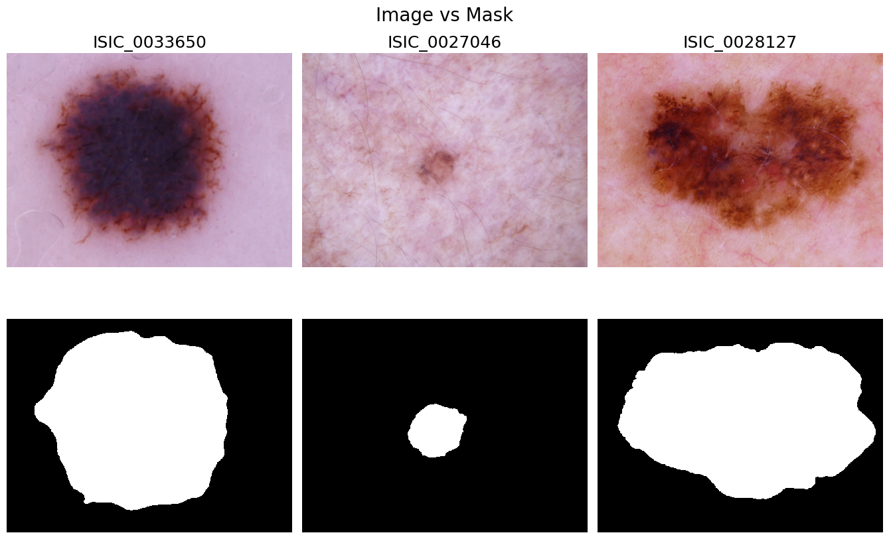
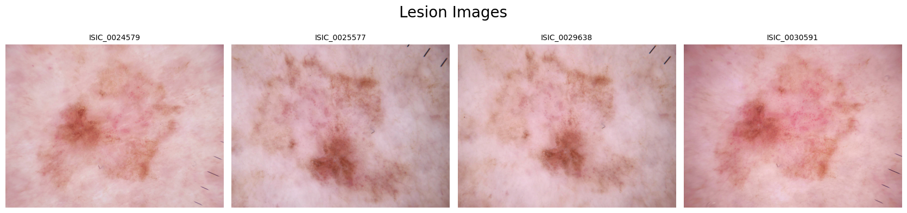
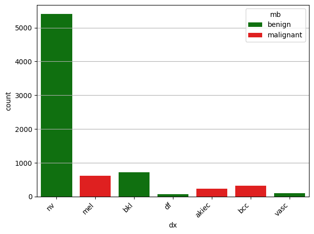
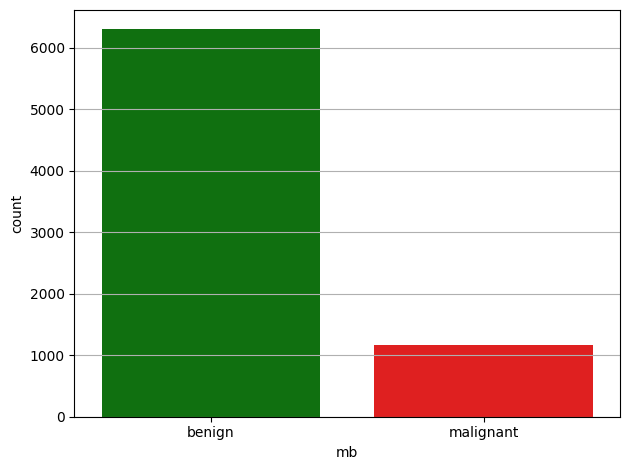
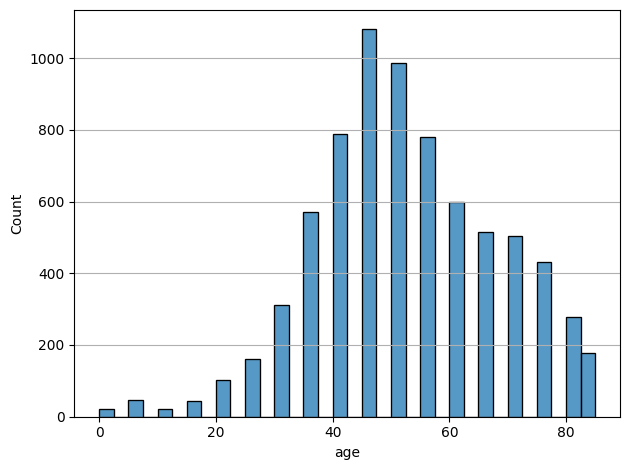
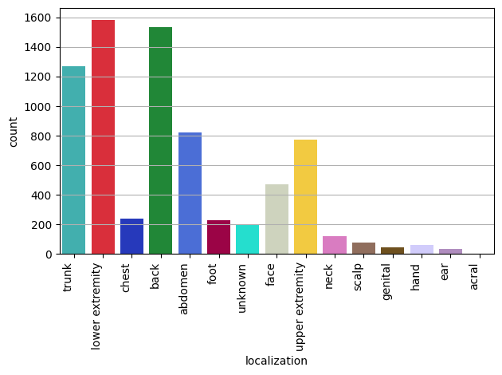

# Data

This file is the single tracked data overview for the repository.
 
## Policy

- Keep dataset contents out of git.
- Put raw source data under `data/raw/`.
- Put derived tables and intermediate analysis outputs under `data/processed/`.
- Keep acquisition dates in dataset-specific `DATE.txt` files where needed.

## HAM10000
* HAM10000 consist of **~10000 [dermatoscopic images](#images) of pigmented skin lesions**, which are the most common type of 
skin lesions.

* The **dataset includes [segmentation masks](#images) for the lesions**, which can be used for 
training and evaluating segmentation models.

* The images have been **annotated with [metadata](#metadata-files)**, including the diagnosis of the lesion, the age and sex of the patient, and the 
localization of the lesion on the body. 

### Sources 
- Harvard Dataverse: `doi:10.7910/DVN/DBW86T`
    * Link to zip files: https://dataverse.harvard.edu/dataset.xhtml?persistentId=doi:10.7910/DVN/DBW86T
- License: CC0 / Public Domain
- Download script: `scripts/download_ham10000.sh`

**Other links:**
- Official HAM10000 GitHub: https://github.com/ptschandl/HAM10000_dataset
- HAM10000 Description by Nature: https://www.nature.com/articles/sdata2018161
- Official med source of originals: ISIC archive https://api.isic-archive.com/collections/212/
- More on dermatoscopy: https://en.wikipedia.org/wiki/Dermatoscopy

### Label Classes (Diagnoses)
See also: [Statistics on labels](#statistics-from-metadata)

**First level** labels are:

- 🔴 = **malignant**  `mb=malignant` (cancer and pre-cancer),
- 🟢 = **benign** `mb=benign` (non-cancer).

❗**Important note**: First level labels were **generated** in ham10000 NB using `src/mse_mlops/analysis/ham10000.py` 
and stored in `data/processed/extended_HAM10000_metadata.csv` file.

**Second level labels** from original (raw) metadata file:

* 🔴 `akiec` = Actinic keratoses and intraepithelial carcinoma / Bowen's disease,
* 🔴 `bcc` = basal cell carcinoma,
* 🟢 `bkl` = benign keratosis-like lesions (solar lentigines / seborrheic keratoses and lichen-planus like keratoses),
* 🟢 `df` = dermatofibroma,
* 🔴 `mel` = melanoma,
* 🟢 `nv` = melanocytic nevi
* 🟢 `vasc` = vascular lesions (angiomas, angiokeratomas, pyogenic granulomas and hemorrhage).

### Images
- **Dermatoscopy images** (basically, high-res photos, .JPG, RGB): directory `HAM10000_images`
- **ROI segmentations** (binary, .PNG, grayscale): directory `HAM10000_segmentations_lesion_tschandl`

**Example:**



❗**Important note**: One lesion with specific `lesion_id` **may have one or more** images.
That can be tracked via `lesion_id` and `image_id` columns in the metadata.
This mapping was done using `src/mse_mlops/analysis/ham10000.py` in ham10000 NB and
stored in `data/processed/all_lesion_images_mapping_HAM10000.csv`.

> **Example:**
> Lesion `HAM_0000005` has **4** images with IDs `ISIC_0024579`, `ISIC_0025577`, `ISIC_0029638`, `ISIC_0030591`:
> 

### Metadata files
- **Raw Metadata**: `data/raw/ham10000/HAM10000_metadata.csv`
- **Extended Metadata** `data/processed/extended_HAM10000_metadata.csv`

❗**Important note**: Extended metadata contains first level labels (`mb` field) that were **generated** 
in by using `src/mse_mlops/analysis/ham10000.py`in ham10000 NB.

### Metadata columns
**Raw metadata** columns:
- `lesion_id` - unique lesion ID, e.g. `HAM_0000118`
- `image_id` - image file ID, e.g. `ISIC_0027419`
- `dx` - diagnosis, e.g. `mel` == melanoma, malignant
- `dx_type` - diagnosis confirmation type, e.g. `histo` == histopathology
- `age` - patient's age, rounded like 55-60-65-70-...
- `sex` - patient's  sex
- `localization` - lesion localization on the body, e.g. `face`
- `dataset` - original dataset

**Extended metadata** columns:
- all raw metadata columns, plus
- `mb` - first level label: `malignant` (cancer or pre-cancer) vs `benign` (non-cancer)

### Dataset Statistics from Metadata
Based on EDA Jupyter notebook. Statistics are based on **unique lesions**, 
not just images (see note on [Images](#images)).

- Full metadata shape: `(10015, 9)`
- Unique lesions metadata shape: `(7470, 9)`

**Labels distribution** 

| **Benign** | Samples | Share | **Malignant** | Samples | Share |
|------------|--------:|------:|---------------|--------:|------:|
| `mb == benign`   | 6301 | 84.35% | `mb == malignant` | 1169 | 15.65% |
| `dx == bkl`      | 727  | 9.73%  | `dx == akiec`     | 228  | 3.05%  |
| `dx == df`       | 73   | 0.98%  | `dx == bcc`       | 327  | 4.38%  |
| `dx == nv`       | 5403 | 72.33% | `dx == mel`       | 614  | 8.22%  |
| `dx == vasc`     | 98   | 1.31%  |                   |       |        |

<p align="center">
  
  
</p>

**Age**

❗Missing fields found: 52 samples (0.70%) `age == NaN`



**Localization**

❗203 samples (2.27%) `localization == unknown`



**Sex**

❗50 samples (0.67%) `sex == unknown`
- 3419 samples (45.77%) `sex == female`
- 4001 samples (53.56%) `sex == male`

### Splits
- No official splits provided by the source.
- Splits were generated via `src/mse_mlops/data_processing.py`
- See also `notebooks/ham10000/data_processing.ipynb` to see how to use the processing methods.

## Melanoma Cancer Dataset (Kaggle)

### Source

- Kaggle: `https://www.kaggle.com/datasets/hasnainjaved/melanoma-skin-cancer-dataset-of-10000-images`
- Latest recorded local acquisition date: `20260226`

### Expected local layout

```text
data/raw/melanoma_cancer_dataset/
  train/
    benign/
    malignant/
  val/                # optional dedicated validation split
    benign/
    malignant/
  future/             # optional production-collected pool kept separate until curated
  test/
    benign/
    malignant/
```
