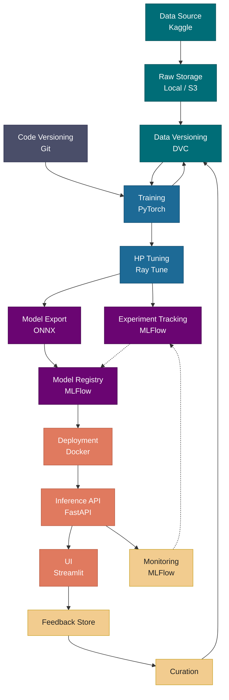

# MLOps Pipeline

This pipeline covers the full lifecycle of a machine learning model — from raw data ingestion to production serving and continuous retraining. It is built around skin cancer classification using the HAM10000 dataset from Kaggle.

The pipeline is divided into five stages:

1. **Data** — Ingest raw images, version datasets with DVC, and track code changes with Git
2. **Training** — Train and tune a CNN classifier using PyTorch and Ray Tune
3. **Experimentation** — Log runs and export the best model to ONNX, registered in MLFlow
4. **Serving** — Deploy via Docker, expose predictions through FastAPI, and surface them in a Streamlit UI
5. **Feedback Loop** — Monitor production performance, collect user corrections, curate new data, and feed it back into the pipeline

## Node Descriptions

- **Data Source (Kaggle)** — Raw skin cancer images from a public dataset
- **Raw Storage** — Unprocessed images stored locally or in the cloud
- **Data Versioning (DVC)** — Tracks and reproduces dataset snapshots
- **Code Versioning (Git)** — Version control for all training code
- **Training (PyTorch)** — Fine-tunes a CNN classifier on the dataset
- **HP Tuning (Ray Tune)** — Distributed hyperparameter optimization
- **Experiment Tracking (MLFlow)** — Logs runs, metrics, and artifacts
- **Model Export (ONNX)** — Serializes the model in a framework-agnostic format
- **Model Registry (MLFlow)** — Stores and stages versioned production models
- **Deployment (Docker)** — Containerizes the model for reproducible serving
- **Inference API (FastAPI)** — Serves real-time REST predictions
- **UI (Streamlit)** — Interactive frontend for end users
- **Monitoring (MLFlow)** — Tracks model performance in production
- **Feedback Store** — Collects and persists user corrections
- **Curation** — Labels and prepares corrected data for retraining
